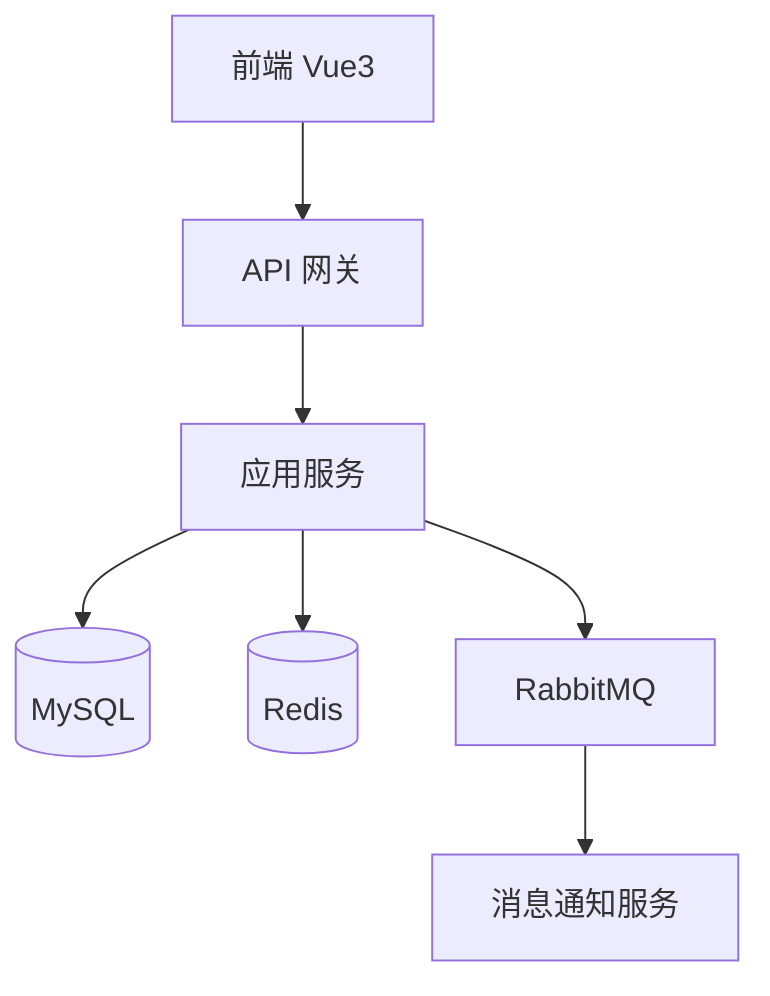

# 03-知识库规范

> **版本**: v1.0 · 2026-05-15
> **适用范围**: `docs/03-knowledge/` 目录下所有知识文档
> **核心原则**: 稳定可复用、见名知意、敏感信息标记、方便 AI 检索

---

## 1. 目录结构

```
docs/03-knowledge/
├── 00-索引.md                     ← 知识库总索引（必须维护）
├── 01-环境配置/                   ← 各环境连接信息、服务地址
│   ├── 00-环境总览.md
│   ├── 01-开发环境.md
│   ├── 02-测试环境.md
│   └── 03-生产环境.md
├── 02-架构设计/                   ← 系统架构、数据模型、关键设计决策
│   ├── 00-架构总览.md
│   ├── 01-系统架构图.md
│   ├── 02-数据库设计规范.md
│   └── 03-关键设计决策.md
├── 03-接口文档/                   ← 内外部接口说明
│   ├── 00-接口总览.md
│   ├── 01-内部接口.md
│   └── 02-外部依赖接口.md
├── 04-运维手册/                   ← 部署、运维、故障处理
│   ├── 00-运维总览.md
│   ├── 01-部署手册.md
│   ├── 02-数据库操作手册.md
│   └── 03-常见故障处理.md
├── 05-业务规则/                   ← 核心业务规则沉淀
│   ├── 00-业务规则总览.md
│   └── 01-{具体业务规则}.md
└── 06-团队规范/                   ← 团队约定、协作规范
    ├── 00-规范总览.md
    └── 01-{具体规范}.md
```

---

## 2. 知识文档分类

### 2.1 环境配置（01-环境配置/）

**存放内容**：数据库连接、服务地址、登录账号、中间件配置。

**敏感信息处理**：

| 信息类型 | 处理方式 |
|----------|----------|
| 数据库密码 | 不存明文，只存账号和连接串格式 |
| 服务登录密码 | 不存明文，注明"密码见团队密码管理工具" |
| API 密钥 | 不存明文，注明"见 .env 文件或密码管理工具" |
| 数据库地址、端口 | 可以存，这是非敏感配置 |
| 账号名 | 可以存 |

**文档格式**：

```markdown
# 01-开发环境

> **最后更新**: 2026-05-15
> **维护人**: [人名]
> ⚠️ 本文档包含环境信息，请勿提交到公开仓库

---

## 数据库

### MySQL 主库
- **地址**: dev-db.internal:3306
- **数据库名**: app_dev
- **账号**: dev_user
- **密码**: 见团队密码管理工具 → "开发数据库"
- **连接串**:
  ```
  jdbc:mysql://dev-db.internal:3306/app_dev
    ?useSSL=false&characterEncoding=utf8&serverTimezone=Asia/Shanghai
  ```

### Redis
- **地址**: dev-redis.internal:6379
- **密码**: 见团队密码管理工具 → "开发 Redis"
- **DB**: 0

---

## 服务地址

| 服务 | 地址 | 说明 |
|------|------|------|
| 后端 API | http://dev-api.internal:8080 | |
| 前端 | http://dev.internal:3000 | |
| Nacos 配置中心 | http://dev-nacos.internal:8848 | |
| MinIO | http://dev-minio.internal:9000 | |

---

## 服务器登录

| 服务器 | IP | 账号 | 登录方式 |
|--------|-----|------|----------|
| 开发服务器 | 192.168.1.10 | devops | SSH 密钥，见团队密钥库 |

---

## 常用命令

```bash
# 连接开发数据库
mysql -h dev-db.internal -u dev_user -p app_dev

# 查看服务日志
ssh devops@192.168.1.10 "tail -f /app/logs/app.log"
```

---

## 注意事项
- 开发环境数据库每周一 0:00 自动重置为测试数据集
- Redis 数据不持久化，重启后清空
```

---

### 2.2 架构设计（02-架构设计/）

**存放内容**：系统架构图、数据库 ER 图、关键设计决策、技术选型原因。

**使用场景**：AI 在处理 Bug 或开发新功能时，先读这里了解全局架构，避免脱离背景做错误决策。

**文档格式**：

```markdown
# 01-系统架构图

> **最后更新**: 2026-05-15
> **版本**: v2.1

---

## 系统整体架构



## 关键设计决策

| 决策 | 选择 | 原因 | 时间 |
|------|------|------|------|
| 审批流实现方式 | 简单状态机（自研） | 业务简单，不引入工作流引擎 | 2026-03 |
| 额度扣减并发控制 | 数据库行锁（SELECT FOR UPDATE） | 并发量低，简单可靠 | 2026-04 |
```

---

### 2.3 接口文档（03-接口文档/）

**存放内容**：核心接口的请求/响应格式、外部依赖的接口说明（如调用 HR 主数据）。

**注意**：不要完整复制 Swagger 文档，只记录**关键接口**和**非常规约定**（如特殊的认证方式、返回码含义）。

---

### 2.4 运维手册（04-运维手册/）

**存放内容**：部署步骤、数据库操作注意事项、常见故障的处理方法。

**使用场景**：Bug 修复涉及数据库操作时，AI 会先读运维手册确认操作规范。

```markdown
# 02-数据库操作手册

## 生产数据库操作规范

### 必须遵守
- 所有 DDL 操作必须通过 Flyway 脚本执行，禁止直接在生产数据库执行 DDL
- 执行任何 DML 前必须先备份受影响的表
- UPDATE/DELETE 必须先用 SELECT 确认影响行数
- 批量操作分批执行，每批不超过 1000 行

### 备份命令
```bash
# 备份单张表
mysqldump -h {host} -u {user} -p {database} {table} > {table}_backup_$(date +%Y%m%d_%H%M%S).sql
```

### 在线 DDL 操作
- varchar 扩容：直接执行，不锁表（MySQL 8.0+）
- 新增列（有默认值）：直接执行，不锁表
- 修改列类型（不兼容）：需要停机或使用 gh-ost
```

---

### 2.5 业务规则（05-业务规则/）

**存放内容**：经过验证的核心业务规则，从需求文档、Bug 修复、代码审查中沉淀。

**使用场景**：AI 在开发新功能时先读业务规则，避免与已有规则冲突。

```markdown
# 01-示例业务核心规则

> 从 F01-示例功能 和历次 Bug 修复中沉淀
> 最后更新: 2026-05-15

## 示例数据更新规则
- 手机号、邮箱等关键字段必须通过格式校验
- 身份标识字段由主数据系统同步，业务页面不允许直接编辑
- 资料变更需要记录操作人、操作时间和来源系统

## 数据一致性规则
- 查询接口默认只返回当前有效记录
- 历史记录只能追加，不允许物理删除
- 外部同步失败时必须保留失败原因和重试状态

## 审批规则
- 两级审批：直属上级 → 业务管理员
- 上级本人提交时：跳级由业务管理员直接审批
- 任意一级拒绝：流程结束，不继续下一级
- 审批超时（72小时无操作）：自动提醒，不自动通过

## 边界规则（历次 Bug 沉淀）
- 备注：最长 500 字（TEXT 类型，2026-05-15 BF01 修复后）
- 审批意见：最长 200 字（varchar(200)，2026-05-10 设计）
```

---

## 3. 文档维护规则

### 3.1 什么时候更新知识库

| 触发事件 | 更新内容 | 更新人 |
|----------|----------|--------|
| Bug 修复完成（09-复盘） | 05-业务规则 补充规则 | AI / 人工 |
| 功能开发完成 | 02-架构设计 更新决策 | AI / 人工 |
| 环境配置变更 | 01-环境配置 更新连接信息 | 人工 |
| 运维操作发现坑 | 04-运维手册 补充注意事项 | 人工 |

### 3.2 什么内容不放知识库

- ❌ 临时笔记（放 `01-features/` 或 `02-bug-fix/` 的具体文档里）
- ❌ 只用一次的技术调研（放对应 feature 的 02-技术方案 里）
- ❌ 未经验证的内容（知识库里的内容必须是"已确认有效"的）
- ❌ 会频繁变动的配置（放代码仓库的配置文件，不放知识库）

### 3.3 AI 读取知识库的时机

大模型在以下场景会主动读取知识库：

| 场景 | 读取目录 |
|------|----------|
| 处理 Bug，需要连接数据库查数据 | `01-环境配置/02-测试环境.md` |
| 开发新功能，需要了解全局架构 | `02-架构设计/00-架构总览.md` |
| 编写业务代码，需要了解已有规则 | `05-业务规则/` |
| 执行数据库操作前 | `04-运维手册/02-数据库操作手册.md` |

---

## 4. 知识库索引（00-索引.md 格式）

`docs/03-knowledge/00-索引.md` 是知识库的总入口，格式如下：

```markdown
# 知识库索引

> 最后更新: 2026-05-15

## 快速找到我要的信息

| 我想找... | 去这里 |
|-----------|--------|
| 开发数据库连接信息 | [[01-环境配置/01-开发环境]] |
| 测试环境服务地址 | [[01-环境配置/02-测试环境]] |
| 生产数据库连接 | [[01-环境配置/03-生产环境]] |
| 系统整体架构 | [[02-架构设计/01-系统架构图]] |
| 示例业务规则 | [[05-业务规则/01-示例业务核心规则]] |
| 数据库操作规范 | [[04-运维手册/02-数据库操作手册]] |
| 部署步骤 | [[04-运维手册/01-部署手册]] |

## 目录

- [[01-环境配置/00-环境总览]]
- [[02-架构设计/00-架构总览]]
- [[03-接口文档/00-接口总览]]
- [[04-运维手册/00-运维总览]]
- [[05-业务规则/00-业务规则总览]]
- [[06-团队规范/00-规范总览]]
```

---

*知识库规范 v1.0 · 2026-05-15*
